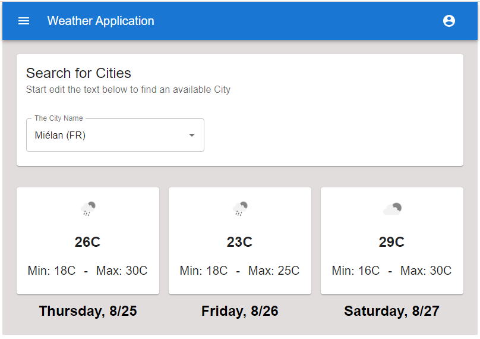

# Welcome to Weather App

This application is built using:

 - AWS Lambda function
 - React.js v18
 - Node.js
 - Material UI Components

## How it works?

Enter some text to retrieve a list of available cities. When you find the right city, the application will load the next 3 days weather forecast.

You can also test a Live version here: 